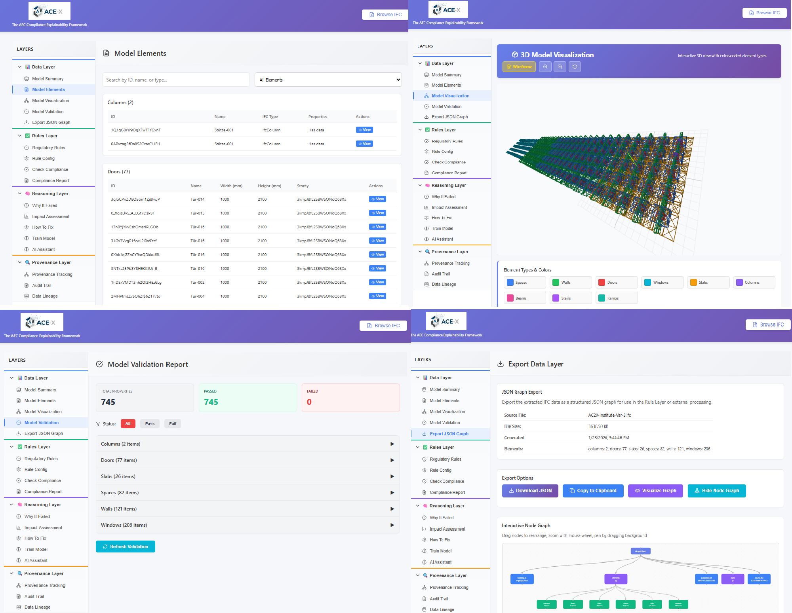
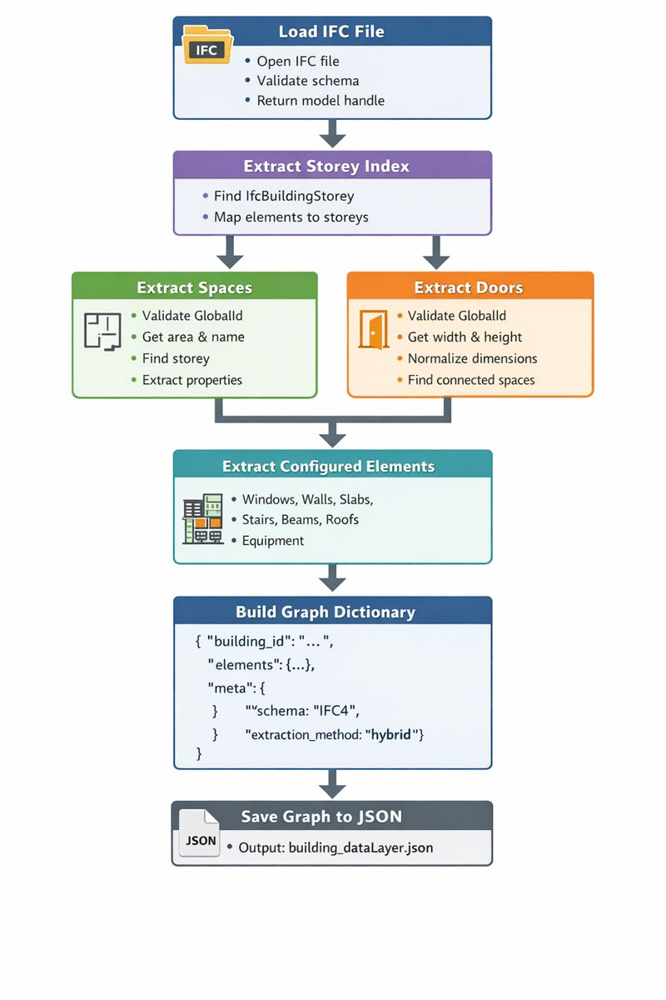
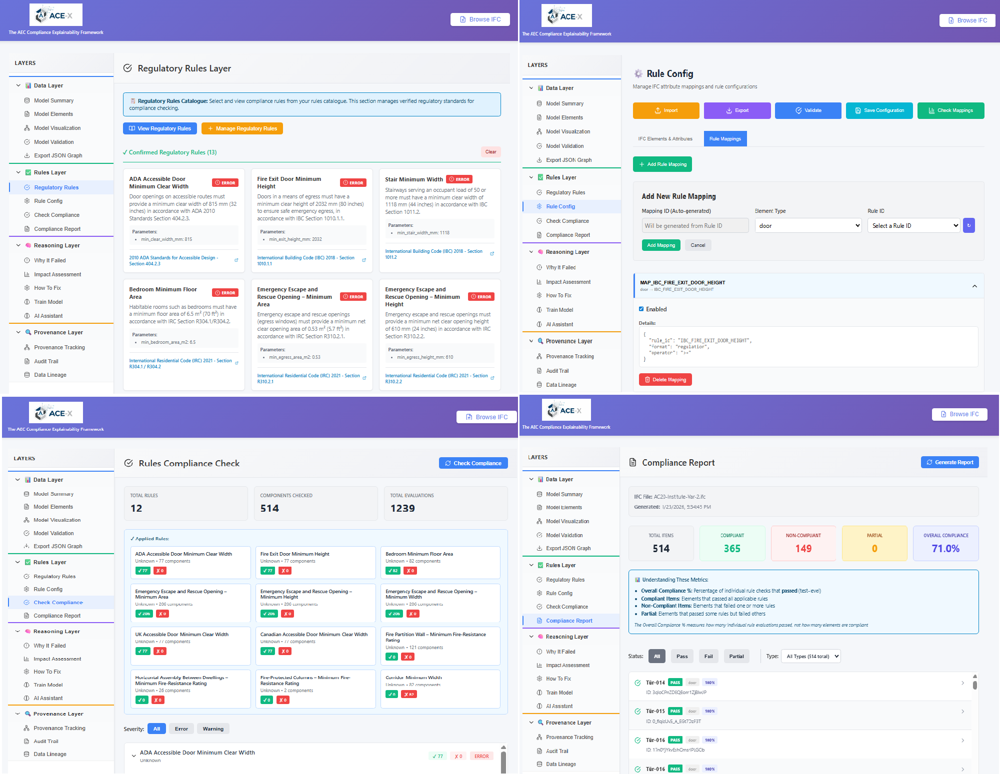
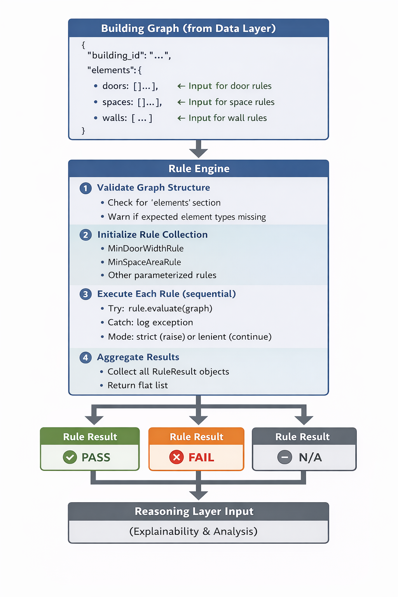
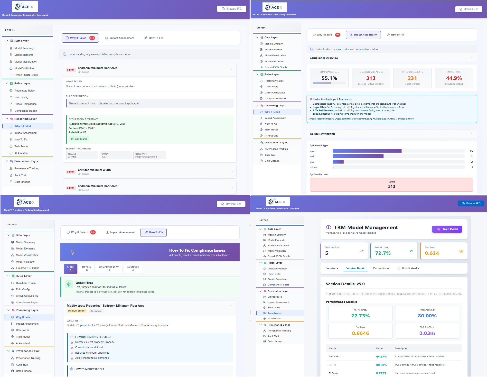
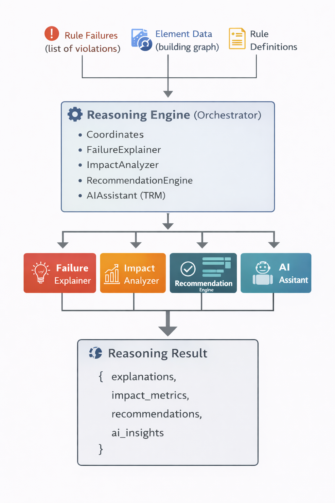
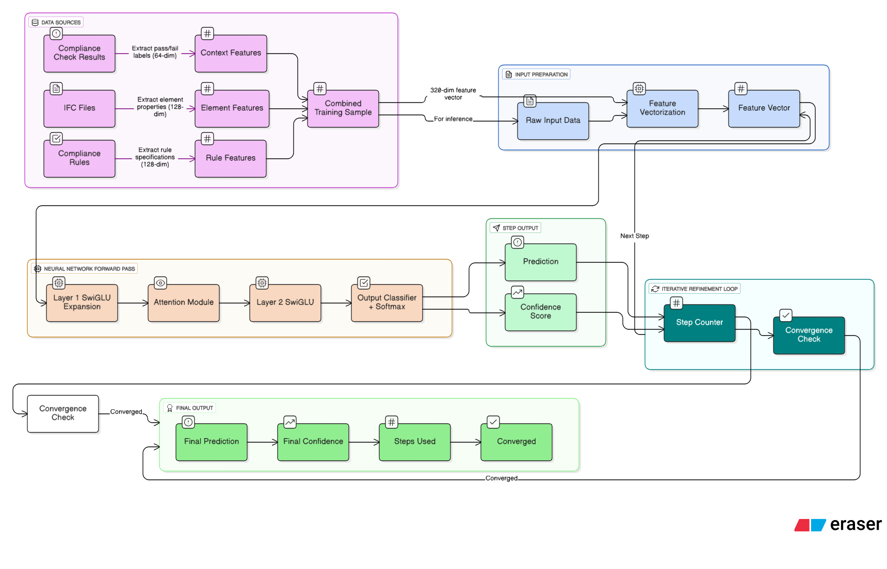
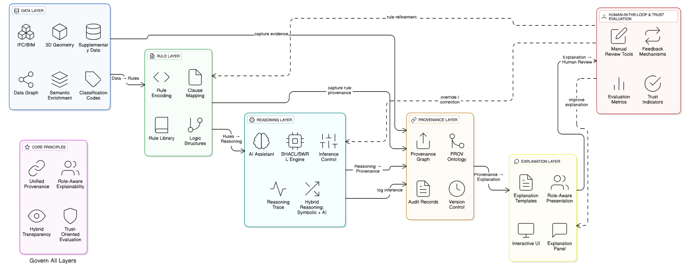

# ACC-Explainability-AEC

A comprehensive system for checking architectural code compliance in BIM (Building Information Modeling) using a layered architecture that combines data extraction, rule-based checking, and AI-driven reasoning with explainable outputs.

---

## 🎯 Key Features

- **Multi-Layer Architecture**: Data extraction → Rule enforcement → AI reasoning
- **IFC Support**: Extracts building information from Industry Foundation Classes files
- **Configurable Rules**: JSON-based rule definitions for flexible compliance checking
- **ML-Based Predictions**: Trained Recognition Model (TRM) for compliance prediction
- **Explainability**: Provides detailed explanations for compliance failures and recommendations
- **Structured Recommendations**: 4-tier effort system (Quick, Medium, Comprehensive, Systemic)
- **RESTful API**: Easy integration with other tools and frontends
- **React Frontend**: Interactive dashboard for visualization and testing

---

## 🏗️ System Architecture


The system operates in three integrated layers:

### 1. **Data Layer** - Normalization & Extraction




Processes IFC files and extracts building information:
- Parses BIM geometry and properties
- Normalizes units across different schemas
- Builds a unified graph representation
- Extracts 128-dimensional feature vectors

**Key Components:**
- `data_layer/extract_core.py` - Core extraction logic
- `data_layer/extract_rules.py` - Rule-specific extraction
- `data_layer/load_ifc.py` - IFC file parsing

### 2. **Rule Layer** - Compliance Checking




Enforces architectural energy code rules:
- Loads configurable JSON rule definitions
- Executes 1200+ rule checks per building
- Generates compliance reports
- Provides rule-level traceability

**Key Components:**
- `rule_layer/engine.py` - Rule execution engine
- `rule_layer/loader.py` - Rule configuration loader
- `rule_layer/run_rules.py` - Batch rule processing

### 3. **Reasoning Layer** - AI Explanations




Generates intelligent explanations and recommendations:
- Analyzes rule compliance failures
- Identifies root causes
- Provides actionable recommendations
- Generates confidence-scored predictions

**Key Components:**
- `reasoning_layer/reasoning_engine.py` - Core reasoning logic
- `reasoning_layer/failure_explainer.py` - Explains failures
- `reasoning_layer/recommendation_engine.py` - Generates fixes
- `reasoning_layer/ai_assistant.py` - AI-powered insights

### TRM (Tiny Recursive Model)


Deep learning model for compliance prediction:
- Trained on 119+ diverse building samples
- Binary compliance classification
- Confidence scoring via softmax
- Validates training data quality (rejects >20% defaulted features)

---

## 📋 Project Structure

```
ACC-Explainability-AEC/
├── backend/                          # Python backend services
│   ├── app.py                       # Main Flask application
│   ├── trm_api.py                   # TRM training & prediction API
│   ├── unified_compliance_engine.py  # Integration layer
│   ├── guid_fragility_fix.py         # Data quality validation
│   ├── data_layer/                  # IFC extraction layer
│   ├── rule_layer/                  # Rule checking layer
│   ├── reasoning_layer/             # AI reasoning layer
│   ├── model_versions/              # Trained model storage
│   └── requirements.txt             # Python dependencies
│
├── frontend/                         # React web interface
│   ├── src/
│   │   ├── components/
│   │   │   ├── TRMDashboard.jsx    # Main dashboard
│   │   │   ├── RuleViewer.jsx      # Rule visualization
│   │   │   └── ComplianceReport.jsx # Results display
│   │   └── App.jsx
│   ├── package.json
│   └── public/
│
├── acc-dataset/                      # Test data
│   ├── IFC/                         # Sample BIM files
│   └── Rules/                       # Rule definitions
│
└── tests/                            # Test suites

```

---

## 🚀 Quick Start

### Prerequisites

- **Python 3.9+**
- **Node.js 16+**
- **npm 8+**

### Backend Setup

1. **Create virtual environment:**
   ```bash
   python -m venv .venv
   # Windows
   .venv\Scripts\activate
   # macOS/Linux
   source .venv/bin/activate
   ```

2. **Install dependencies:**
   ```bash
   pip install -r backend/requirements.txt
   ```

3. **Start the backend API:**
   ```bash
   cd backend
   python app.py
   ```
   Backend runs on `http://localhost:5000`

### Frontend Setup

1. **Install dependencies:**
   ```bash
   cd frontend
   npm install
   ```

2. **Start development server:**
   ```bash
   npm start
   ```
   Frontend runs on `http://localhost:3000`

### Test with Sample Data

```bash
# Check compliance of sample IFC file
python backend/unified_compliance_engine.py --file acc-dataset/IFC/sample.ifc

# Run rule validation
python backend/rule_layer/run_rules.py --config acc-dataset/Rules/rules.json

# Train TRM model
python backend/trm_api.py --action train --data data/trm_incremental_data.json
```

---

## ⚙️ Configuration

### Rules Configuration

Edit rule files in `acc-dataset/Rules/` (JSON format):

```json
{
  "rule_id": "WINDOW_AREA",
  "jurisdiction": "AEC",
  "description": "Window-to-wall ratio check",
  "category": "thermal_envelope",
  "checks": [
    {
      "element_type": "Window",
      "properties": ["area", "parent_wall_area"],
      "condition": "area / parent_wall_area <= 0.40"
    }
  ]
}
```

### Data Extraction Config

Modify `data_layer/extraction_config.json` to control:
- Which IFC properties to extract
- Feature engineering rules
- Unit conversion settings

### Model Training

Configure training in the backend API:

```bash
curl -X POST http://localhost:5000/api/trm/train \
  -H "Content-Type: application/json" \
  -d '{
    "data_source": "incremental",
    "validation_threshold": 0.20,
    "epochs": 100
  }'
```

---

## 🧪 Testing

### Run Backend Tests

```bash
# Integration tests
python -m pytest backend/test_e2e_sync.py -v

# Rule validation
python -m pytest backend/test_rules_sync.py -v

# TRM validation
python -m pytest backend/test_auto_sync_integration.py -v
```

### Test Compliance Engine

```bash
# Full compliance check
python backend/unified_compliance_engine.py \
  --file acc-dataset/IFC/sample.ifc \
  --rules acc-dataset/Rules/ \
  --verbose
```

---

## 📊 Explainability Framework



The system provides multi-level explanations:

### Level 1: Rule Violations
- Which rules failed
- What requirements were not met
- Evidence from the IFC model

### Level 2: Root Cause Analysis
- Why the violation occurred
- Contributing factors
- Impact assessment

### Level 3: Recommendations
- How to fix the issue
- Effort level (Quick, Medium, Comprehensive, Systemic)
- Expected impact and cost

### Level 4: Confidence Scoring
- Model confidence in prediction (0-100%)
- Reasoning confidence
- Recommendation confidence

---

## 🔌 API Endpoints

### Training & Model Management

```
POST   /api/trm/train              - Train new model
GET    /api/trm/versions           - List model versions
GET    /api/trm/version/{id}       - Get model details
DELETE /api/trm/version/{id}       - Delete model version
```

### Compliance Checking

```
POST   /api/check                  - Check compliance
GET    /api/check/status/{id}      - Get check status
GET    /api/report/{id}            - Get compliance report
```

### Rule Management

```
GET    /api/rules                  - List all rules
GET    /api/rules/{category}       - Rules by category
POST   /api/rules/validate         - Validate rule definition
```

---

## 📝 Key Files Reference

### Core Components

| File | Purpose |
|------|---------|
| `backend/app.py` | Flask application entry point |
| `backend/unified_compliance_engine.py` | Main compliance orchestrator |
| `backend/guid_fragility_fix.py` | Data quality validation |
| `backend/trm_trainer.py` | Model training logic |
| `frontend/src/components/TRMDashboard.jsx` | Main UI dashboard |

### Data Processing

| File | Purpose |
|------|---------|
| `data_layer/extract_core.py` | IFC parsing and normalization |
| `data_layer/build_graph.py` | Building graph construction |
| `data_layer/services.py` | Data service utilities |

### Rule Engine

| File | Purpose |
|------|---------|
| `rule_layer/engine.py` | Rule execution engine |
| `rule_layer/compliance_checker.py` | Compliance validation |
| `rule_layer/loader.py` | Rule configuration loading |

### Reasoning

| File | Purpose |
|------|---------|
| `reasoning_layer/reasoning_engine.py` | Reasoning orchestration |
| `reasoning_layer/failure_explainer.py` | Failure analysis |
| `reasoning_layer/recommendation_engine.py` | Recommendation generation |

---

## 🔍 Troubleshooting

### 72.2% Accuracy Issue
If the TRM model shows stuck at 72.2% accuracy:
- This is a cached model from incomplete training data
- Clear model cache: `rm -rf backend/model_versions/`
- Retrain with validated data: `python backend/retrain_fixed.py`

### GUID Mismatch Errors
If you see missing building elements:
- Check IFC file completeness: `python backend/data_validator.py`
- Validate unit consistency: `python backend/validate_mappings.py`
- Review extraction logs: Check debug output in `data/debug_features.txt`

### Rule Execution Timeout
If rules take too long to execute:
- Reduce rule count (exclude non-essential categories)
- Optimize IFC file (remove unnecessary elements)
- Use rule filtering: `rule_layer.json` -> `"enabled": false` for rules to skip

---

## 🎓 How It Works

1. **User uploads IFC file** via frontend
2. **Data Layer extracts** building information and normalizes it
3. **Rule Layer executes** 1200+ compliance checks
4. **TRM predicts** overall compliance using ML model
5. **Reasoning Layer analyzes** failures and generates explanations
6. **Frontend displays** results with interactive visualizations
7. **User reviews** recommendations and takes action

---

## 📚 Documentation

For detailed technical documentation, see:
- **Data Layer**: `data_layer/README.md` (or code comments)
- **Rule Layer**: `rule_layer/manifest_schema.json` (rule definition format)
- **Reasoning Layer**: `reasoning_layer/config.py` (reasoning engine config)
- **Training**: `backend/trm_trainer.py` (model training details)

---

## 🤝 Contributing

To contribute:

1. Create a feature branch
2. Make your changes
3. Run tests: `pytest tests/`
4. Submit a pull request

---
## 👥 Contact & Support

For questions or issues:
- Check existing GitHub issues
- Review the troubleshooting section above
- Contact the development team


---

**Last Updated:** January 26, 2026
